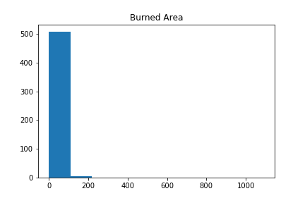
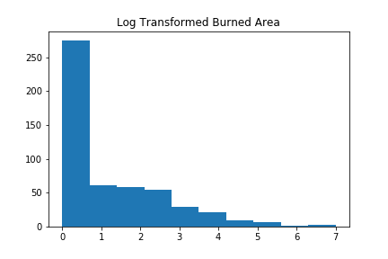

## Project: ForestFiresDataML

**Created by: Cem Sinan Ozturk**

**Date Created: 2018-01-27**

### Data Information

The Forest Fires data is available at UCI, to reach it please click [here](http://archive.ics.uci.edu/ml/datasets/Forest+Fires).

The citation to this data set: 

[Cortez and Morais, 2007] P. Cortez and A. Morais. A Data Mining Approach to Predict Forest Fires using Meteorological Data. In J. Neves, M. F. Santos and J. Machado Eds., New Trends in Artificial Intelligence, Proceedings of the 13th EPIA 2007 - Portuguese Conference on Artificial Intelligence, December, Guimarães, Portugal, pp. 512-523, 2007. APPIA, ISBN-13 978-989-95618-0-9. Available at: [http://www.dsi.uminho.pt/~pcortez/fires.pdf](http://www3.dsi.uminho.pt/pcortez/fires.pdf)

### Response Variable and Predictors:

**Response Variable:** `area` which is the burned area in forest. 
- We see the original paper used this variable after log transformation since *variable is very skewed towards 0.0*. After fitting the models, the outputs were post-processed with the inverse of the ln(x+1) transform

**Predictiors:** We need to assign dummy variables for categorical variables `month` and `day`. 

The area variable before `log(area+1)` transformation:

The area variable after `log(area+1)` transformation:

 As we can see from the histograms, log transformation helps the area variable to spread out. 

#### Model and Feature Selection Process:

I will also try predict the `area` variable via regression models.

 - First, I fit the data with all features to Random Forest Regression with pruned `depth` hyperparameters.
 - Then I will use to Lasso(L1 regularization) Regression and ElasticNet(L1+L2 regularization) Regression to select features. I will not use Ridge(L2 regularization) since it does not any exact zero weigthed features.
 - As last step, I will fit the data to Random Forest Regression with pruned `depth` hyperparameters onto both features selected by Lasso and ElasticNet.

 ### How to Run the Analysis
 
First, please clone or download the repository.

Then, open `ForestFiresAnalysis.ipynb` in your preference of Python notebook environment.

You can run all the code and see the result files are generated.
 
 ### Dependencies
 
 The following python libraries are required to be able to perform the analysis.
 
 - `pandas`
 -  `numpy`
 - `matplotlib`
 - `sklearn`

[Analysis Code can be found here]("./src/ForestFiresAnalysis.ipynb")

[Please click here for the Project Report]("./results/Report.ipynb")